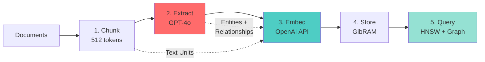

# Use Python SDK (v0.1.0)

Get from zero to working GraphRAG in 5 minutes. The SDK handles chunking, extraction, embedding, and storage automatically.

## Prerequisites

- **Python 3.8+** installed
- **GibRAM Server** running on port 6161 ([see how](server.md))
- **OpenAI API Key** for extraction and embeddings

## Install

```bash
pip install gibram
export OPENAI_API_KEY="sk-..."
```

## Hero Example

Save this as `demo.py`:

```python
from gibram import GibRAMIndexer

# Initialize indexer (connects to localhost:6161)
indexer = GibRAMIndexer(session_id="my-project")

# Index documents (automatic: chunk → extract → embed → store)
stats = indexer.index_documents([
    "Albert Einstein was born in 1879 in Ulm, Germany.",
    "He developed the theory of relativity in 1905.",
    "Einstein received the Nobel Prize in Physics in 1921.",
])

print(f"✓ Indexed {stats.entities_extracted} entities")
print(f"✓ Created {stats.relationships_extracted} relationships")

# Query: vector search + graph traversal
result = indexer.query("Einstein's achievements", top_k=5)

for entity in result.entities:
    print(f"{entity.title} ({entity.type}): {entity.score:.3f}")
```

Run it:

```bash
python demo.py
```

**Expected Output**:

```
Processing documents: 100%|████████████| 3/3 [00:15<00:00,  5.2s/doc]
✓ Indexed 8 entities
✓ Created 5 relationships

ALBERT EINSTEIN (person): 0.912
THEORY OF RELATIVITY (concept): 0.856
NOBEL PRIZE IN PHYSICS (achievement): 0.798
```

## What Just Happened?

The SDK executed this pipeline automatically:



**Pipeline Steps**:

1. **Chunked** documents into ~512 token chunks (with 50 token overlap)
2. **Extracted** entities and relationships using GPT-4o (💰 LLM calls here)
3. **Embedded** chunks and entities via OpenAI API (text-embedding-3-small, 1536 dims)
4. **Stored** everything in GibRAM server under session "my-project"
5. **Queried** using HNSW vector search + graph traversal

**Cost**: ~$0.10 for 3 documents (3 LLM calls + 12 embeddings)

## ⚠️ Important: Dimension Mismatch

**Server and SDK embedding dimensions MUST match.**

- **Server default**: 1536 (configure via `--dim` flag or config file)
- **SDK default**: 1536 (OpenAI text-embedding-3-small)

**If using different embedding model**:

```python
# Server: gibram-server --dim 768
# SDK:
indexer = GibRAMIndexer(
    embedding_dimensions=768  # MUST match server
)
```

**Symptom if mismatch**: Runtime error `dimension mismatch: expected 1536, got 768`

## Next Steps

### Step-by-Step Tutorial

**[Python SDK Quickstart](../sdks/python/quickstart.md)** - 6-step walkthrough with indexing, querying, and RAG examples

### Deep Dives

- **[SDK Overview](../sdks/python/index.md)** - Architecture, components, and customization
- **[Server Configuration](../server/configuration-basics.md)** - TLS, auth, persistence, TTL
- **[Troubleshooting](../server/troubleshooting.md)** - Connection refused, dimension mismatch, OpenAI errors
