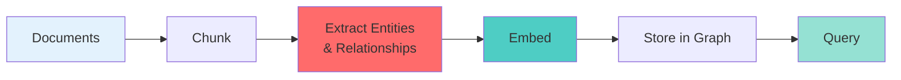
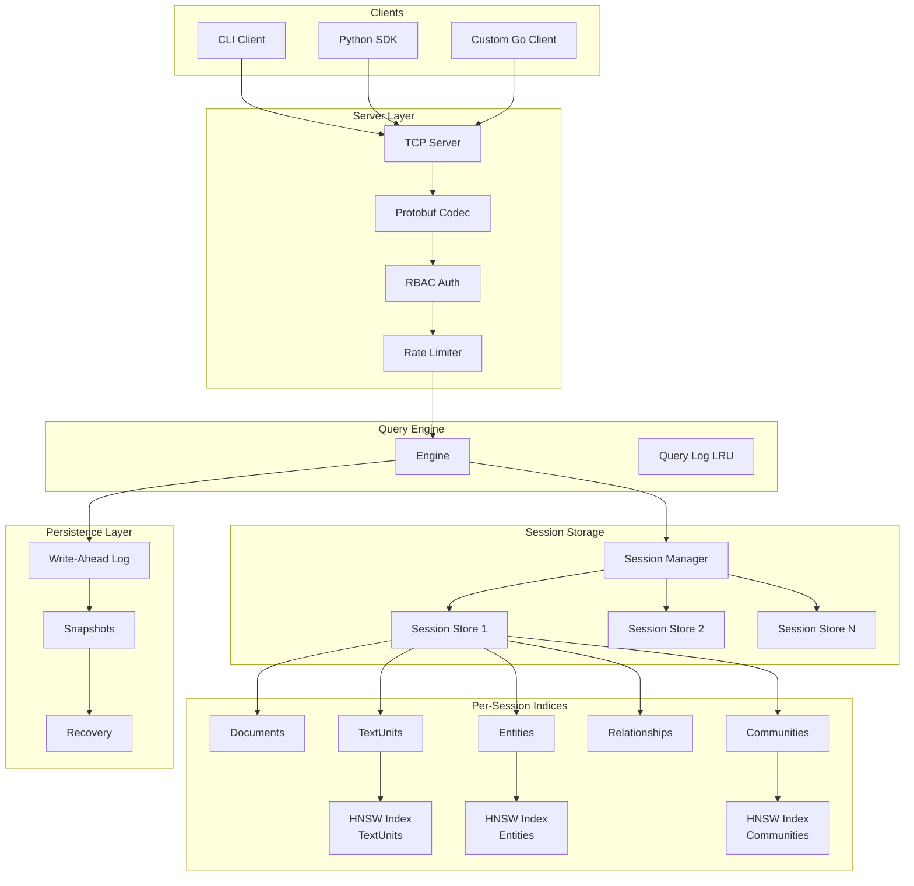

# GibRAM

**Graph in-Buffer Retrieval & Associative Memory** • **v0.1.0**

GibRAM is an in-memory knowledge graph server designed for retrieval augmented generation (RAG) workflows. It combines graph storage with vector search so related information stays connected in memory.

## What is GibRAM?

- **In-Memory & Ephemeral**: Data lives in RAM with configurable time-to-live. Built for short-lived analysis, not persistent storage.
- **Graph + Vectors Together**: Stores entities, relationships, and document chunks alongside their embeddings in a unified structure.
- **Graph-Aware Retrieval**: Supports both semantic search and graph traversal, retrieving context that pure vector search might miss.
- **Python SDK**: GraphRAG-style workflow for indexing documents and querying with minimal code.

## Quick Start

Choose your path:

- **[Run Server](getting-started/server.md)** - Install and run GibRAM server (port 6161)
- **[Use Python SDK](getting-started/python-sdk.md)** - Index documents and query in 10 lines of Python

## Why GibRAM?

**Problem**: Vector search alone often misses important context. If a query mentions "Einstein", traditional RAG might retrieve chunks about Einstein, but miss related entities like "Theory of Relativity" or "Nobel Prize" that aren't semantically similar to the query.

**Solution**: GibRAM stores knowledge as a graph. When you query for "Einstein", it retrieves:
1. Semantically similar chunks (via embeddings)
2. Connected entities and relationships (via graph traversal)
3. Community summaries (via hierarchical clustering)

This gives you richer, more complete context for generation.

## How It Works

1. **Server** runs on port 6161, manages sessions (isolated data per project)
2. **SDK** handles chunking, extraction (via LLM), embedding, and storage
3. **Query** combines vector similarity + graph traversal for complete results

## Architecture

**Session-based multi-tenancy**: Each session is an isolated namespace with automatic TTL cleanup (absolute + idle timeout). Sessions are ephemeral by design. When TTL expires or server restarts, data is gone (unless persistence is enabled).

## Key Features

- **HNSW Vector Index**: Fast approximate nearest neighbor search (O(log N))
- **Hierarchical Leiden Clustering**: Automatic community detection at multiple levels
- **Protobuf Protocol**: Efficient binary wire format for production use
- **Custom Components**: Swap chunkers, extractors, or embedders in Python SDK
- **Optional Persistence**: WAL + Snapshot for durability (disabled by default)

## System Requirements

- **Server**: Go 1.24+, 2GB+ RAM recommended
- **Python SDK**: Python 3.8+
- **LLM API**: OpenAI API key for extraction and embeddings

## Next Steps

1. **[Start the server](getting-started/server.md)** - Get GibRAM running locally
2. **[Index your first documents](getting-started/python-sdk.md)** - Try the Python SDK
3. **[Configure for production](server/configuration-basics.md)** - Security, TLS, auth

## Support

- **Issues**: [GitHub Issues](https://github.com/gibram-io/gibram/issues)
- **Documentation**: This site
- **License**: MIT
