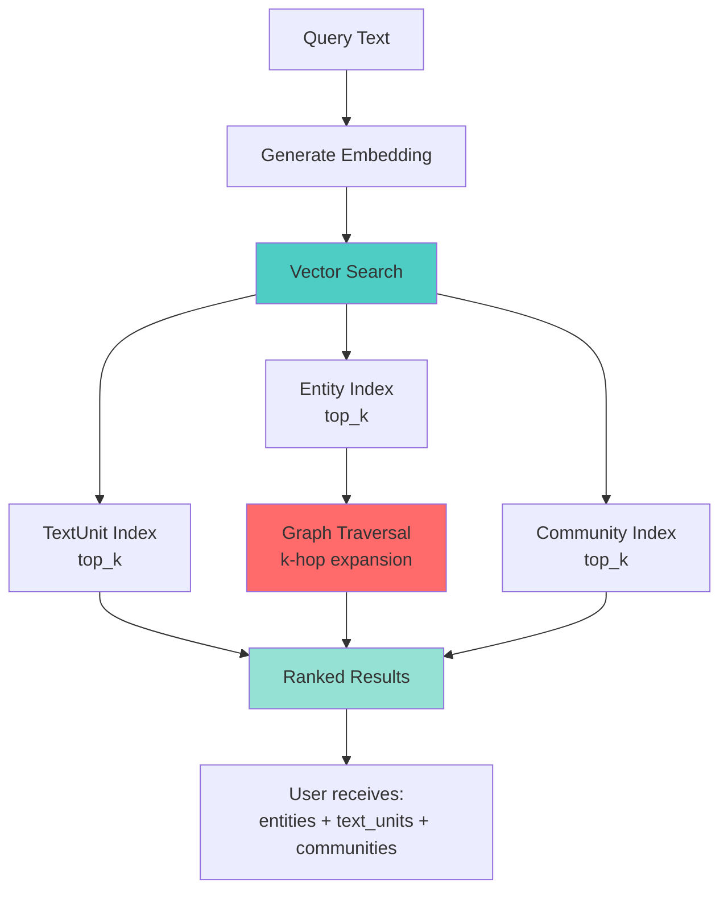

# Python SDK Quickstart (v0.1.0)

Get started with GibRAM Python SDK in 5 minutes. This guide walks through installation, indexing, and querying.

## Prerequisites

- **Python 3.8+** installed
- **GibRAM server** running on port 6161 (see [Run Server](../../getting-started/server.md))
- **OpenAI API key** for extraction and embeddings

## Step 1: Install SDK

```bash
pip install gibram
```

Verify installation:

```bash
python -c "import gibram; print(gibram.__version__)"
# Expected: 0.1.0
```

## Step 2: Set API Key

```bash
export OPENAI_API_KEY="sk-..."
```

Or pass directly to `GibRAMIndexer` (see Step 3).

## Step 3: Index Documents

Create `index.py`:

```python
from gibram import GibRAMIndexer

# Initialize indexer
indexer = GibRAMIndexer(
    session_id="quickstart-demo",
    host="localhost",
    port=6161,
    # llm_api_key="sk-...",  # Optional: override env var
)

# Sample documents about Einstein
documents = [
    "Albert Einstein was born on March 14, 1879, in Ulm, Germany.",
    "He developed the theory of relativity, one of the two pillars of modern physics.",
    "Einstein received the Nobel Prize in Physics in 1921 for his discovery of the photoelectric effect.",
    "He emigrated to the United States in 1933 and became an American citizen in 1940.",
]

# Index documents
print("Indexing documents...")
stats = indexer.index_documents(
    documents,
    batch_size=10,
    show_progress=True
)

# Print statistics
print("\n=== Indexing Complete ===")
print(f"Documents indexed: {stats.documents_indexed}")
print(f"Text units created: {stats.text_units_created}")
print(f"Entities extracted: {stats.entities_extracted}")
print(f"Relationships extracted: {stats.relationships_extracted}")
print(f"Communities detected: {stats.communities_detected}")
print(f"Time taken: {stats.indexing_time_seconds:.2f}s")
```

Run:

```bash
python index.py
```

**Expected Output**:

```
Indexing documents...
Processing documents: 100%|██████████| 4/4 [00:08<00:00,  2.1s/doc]
Generating embeddings...
Storing entities...
Storing relationships...

=== Indexing Complete ===
Documents indexed: 4
Text units created: 4
Entities extracted: 12
Relationships extracted: 8
Communities detected: 2
Time taken: 8.45s
```

### What Just Happened?

1. **Chunking**: Each document was treated as one chunk (small docs)
2. **Extraction**: GPT-4o extracted entities (Einstein, Germany, Nobel Prize, etc.) and relationships (born_in, received, etc.)
3. **Embedding**: Generated embeddings for chunks and entities via OpenAI API
4. **Storage**: Stored in GibRAM server under session "quickstart-demo"
5. **Clustering**: Detected 2 communities (Einstein-related entities grouped)

**Cost**: ~$0.10 for 4 documents (4 LLM calls + ~20 embeddings)

## Step 4: Query

Create `query.py`:

```python
from gibram import GibRAMIndexer

# Connect to same session
indexer = GibRAMIndexer(
    session_id="quickstart-demo",
    host="localhost",
    port=6161,
)

# Query 1: Biographical information
print("Query: Where was Einstein born?\n")
result = indexer.query("Where was Einstein born?", top_k=3)

print(f"Found {len(result.entities)} entities:")
for entity in result.entities[:3]:
    print(f"  - {entity.title} ({entity.type}): {entity.score:.3f}")
    print(f"    {entity.description[:100]}...")

print(f"\nFound {len(result.text_units)} text chunks:")
for chunk in result.text_units[:2]:
    print(f"  - {chunk.content[:80]}... [score: {chunk.score:.3f}]")

# Query 2: Scientific achievements
print("\n" + "="*50)
print("\nQuery: Einstein's scientific contributions\n")
result = indexer.query("Einstein's scientific contributions", top_k=5)

print(f"Top Entities:")
for entity in result.entities[:5]:
    print(f"  {entity.title} ({entity.type}): {entity.score:.3f}")
```

Run:

```bash
python query.py
```

**Expected Output**:

```
Query: Where was Einstein born?

Found 3 entities:
  - ALBERT EINSTEIN (person): 0.923
    German-born theoretical physicist who developed the theory of relativity...
  - ULM (location): 0.887
    City in Germany where Albert Einstein was born...
  - GERMANY (location): 0.856
    Country in Europe where Einstein was born...

Found 2 text chunks:
  - Albert Einstein was born on March 14, 1879, in Ulm, Germany. [score: 0.912]
  - He emigrated to the United States in 1933 and became an American citizen... [score: 0.734]

==================================================

Query: Einstein's scientific contributions

Top Entities:
  THEORY OF RELATIVITY (concept): 0.945
  ALBERT EINSTEIN (person): 0.901
  NOBEL PRIZE IN PHYSICS (achievement): 0.876
  PHOTOELECTRIC EFFECT (concept): 0.834
  MODERN PHYSICS (field): 0.789
```

### Understanding Results



**Entities**:
- Extracted concepts, people, places
- Scored by semantic similarity to query
- Includes descriptions (useful for LLM context)

**Text Units**:
- Original document chunks
- Scored by embedding similarity
- Raw text for citation

**Score Interpretation**:
- `0.9 - 1.0`: Highly relevant
- `0.7 - 0.9`: Relevant
- `< 0.7`: May not be relevant (depends on threshold)

## Step 5: Build RAG Answer

Create `rag.py`:

```python
from gibram import GibRAMIndexer
import openai

indexer = GibRAMIndexer(session_id="quickstart-demo")

# Query
question = "What are Einstein's major achievements?"
result = indexer.query(question, top_k=5)

# Build context from results
context_parts = []

# Add entity information
context_parts.append("Relevant Entities:")
for entity in result.entities[:3]:
    context_parts.append(f"- {entity.title}: {entity.description}")

# Add source chunks
context_parts.append("\nSource Text:")
for chunk in result.text_units[:2]:
    context_parts.append(f"- {chunk.content}")

context = "\n".join(context_parts)

# Generate answer with GPT-4
client = openai.OpenAI()
response = client.chat.completions.create(
    model="gpt-4o",
    messages=[
        {
            "role": "system",
            "content": "You are a helpful assistant. Answer based on the provided context."
        },
        {
            "role": "user",
            "content": f"Context:\n{context}\n\nQuestion: {question}\n\nAnswer:"
        }
    ]
)

print("Question:", question)
print("\nAnswer:", response.choices[0].message.content)
print("\nSources:")
for i, chunk in enumerate(result.text_units[:2], 1):
    print(f"{i}. {chunk.content[:100]}...")
```

**Expected Output**:

```
Question: What are Einstein's major achievements?

Answer: Albert Einstein's major achievements include developing the theory of 
relativity, which became one of the two pillars of modern physics. He also 
received the Nobel Prize in Physics in 1921 for his discovery of the photoelectric 
effect, which was fundamental to the development of quantum theory.

Sources:
1. He developed the theory of relativity, one of the two pillars of modern physics...
2. Einstein received the Nobel Prize in Physics in 1921 for his discovery of the...
```

## Step 6: Clean Up (Optional)

Sessions persist until:
1. Server restarts (ephemeral mode)
2. TTL expires (if configured)
3. Manual deletion

**Note**: In v0.1.0, session deletion requires low-level client or CLI. High-level SDK support coming in future versions.

## Next Steps

### Learn More

- **[SDK Overview](index.md)** - Architecture and components
- **[Indexing Workflow](workflow-indexing.md)** - Deep dive into indexing pipeline
- **[Query Workflow](workflow-query.md)** - Deep dive into query execution

### Advanced Usage

- **[Custom Components](advanced/custom-components.md)** - Build custom chunker/extractor/embedder
- **[Configuration](configuration.md)** - All parameters explained
- **[Examples](examples/minimal.md)** - More code samples

### Production Deployment

- **[Server Configuration](../../server/configuration-basics.md)** - TLS, auth, persistence
- **[Troubleshooting](../../server/troubleshooting.md)** - Common issues

## Common Issues

### "Connection refused"

**Cause**: Server not running.

**Fix**:
```bash
# Start server
gibram-server --insecure

# Verify with CLI client
gibram-cli -h localhost:6161 -insecure true
# Then type: PING
# Expected: PONG (XXXms)
```

### "Dimension mismatch"

**Cause**: Server vector_dim ≠ SDK embedding_dimensions.

**Fix**:
```python
# Check server dimension (via CLI: INFO command)
# Then match in SDK:
indexer = GibRAMIndexer(
    embedding_dimensions=1536  # Match server
)
```

### "OpenAI rate limit"

**Cause**: Too many API calls too quickly.

**Fix**:
```python
# Reduce batch size
stats = indexer.index_documents(
    documents,
    batch_size=5  # Slower but less likely to hit limits
)
```

### "Extraction failed for chunk"

**Cause**: LLM returned invalid JSON or timed out.

**Impact**: That chunk is skipped (not a critical error).

**Fix**: Retry indexing. If persists, check OpenAI service status.

## Cost Estimation

**OpenAI Pricing** (as of Jan 2024):
- GPT-4o: ~$0.01 per chunk extraction
- Embeddings (text-embedding-3-small): ~$0.0001 per embedding

**Example**:
- 100 documents
- Average 4 chunks per document = 400 chunks
- Cost: (400 × $0.01) + (400 × $0.0001) = **$4.04**

**Reduce costs**:
- Use `gpt-4o-mini` (cheaper)
- Increase `chunk_size` (fewer chunks)
- Disable `auto_detect_communities`

## Full Example Code

See complete runnable examples:
- [examples/basic_indexing.py](https://github.com/gibram-io/gibram/blob/main/sdk/python/examples/basic_indexing.py)
- [examples/custom_implementation.py](https://github.com/gibram-io/gibram/blob/main/sdk/python/examples/custom_implementation.py)
